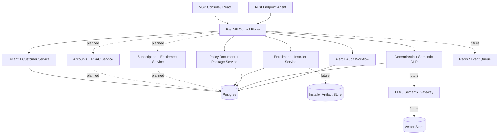

# Aetherix Architecture

Status: active POC architecture, May 2026. Companion to [docs/poc-plan.md](poc-plan.md), [docs/development.md](development.md), and [docs/policy-engine.md](policy-engine.md).
Scope: the system spine — what the pieces are, what they own, how they talk,
and where the trust boundaries sit. Not a feature catalogue.

This document is **independent**: it describes one defensible design for an
AI-native endpoint security platform. It is not a clone of any commercial
product and intentionally avoids replicating any vendor's documented internals,
APIs, UI, or terminology.

---

## 1. Design Principles

1. **Small trusted core, large untrusted edges.** The agent stays minimal and
   auditable. Anything optional (semantic classifiers, LLM reasoning, third-
   party intel) runs in the control plane, never on the endpoint.
2. **Deterministic before probabilistic.** Every AI-driven decision has a
   deterministic fallback (regex/keyword/hash). The agent never blocks based
   solely on an LLM output.
3. **Policy is data, not code.** Policies are versioned, signed documents
   evaluated by a small interpreter. The agent does not download executable
   logic.
4. **Two-way distrust between planes.** The control plane authenticates
   agents; agents verify policy signatures and reject unsigned updates.
5. **Default monitor, opt-in enforce.** New rules ship in `monitor` mode.
   Promotion to `review` or `block` requires explicit operator action with
   simulation evidence attached.
6. **Auditability over cleverness.** Every decision (detect, allow, block,
   acknowledge, policy change) writes an append-only audit record with the
   input hash, rule id, and policy version that produced it.
7. **Privacy budget.** Raw matched content never leaves the endpoint without
   a policy-declared reason. By default, only entity types, offsets, and
   hashes are shipped.

---

## 2. Planes



Each plane has its own deploy/scale story and its own threat model
(section 6). A failure in the reasoning plane must degrade to deterministic
detection, not to "fail open."

---

## 3. Component Responsibilities

### 3.1 Endpoint Agent (`agent/`)

Today: enrolls with a one-time token or installer profile, stores a per-agent secret, fetches assigned policy packages, and emits nonce-bound signed heartbeats. Forward design owns four jobs and no more:

| Job | Owns | Does NOT own |
| --- | --- | --- |
| Identity | Agent id, machine fingerprint, enrollment cert | User identity, SSO |
| Telemetry | Heartbeat, host signals, local event stream | Long-term storage |
| Local scan | Deterministic DLP rules over text the OS hands it | Semantic/LLM scoring |
| Enforcement | Apply policy actions (`monitor`/`review`/`block`) | Author policy |

Hard constraints:

- No outbound calls except to the configured control-plane URL.
- No code execution from policy payloads. Policy is a typed document with
  a fixed schema; unknown fields are ignored, unknown actions are refused.
- All persisted state lives under one directory with a documented schema
  so it can be audited or wiped.
- Performance budget enforced in CI: p95 heartbeat CPU, RSS ceiling, and
  per-scan latency are tracked per release.

### 3.2 Control Plane API (`apps/api/`)

Owns the system of record. Implemented route groups:

- Agent lifecycle: `/enrollment/tokens`, `/agent/enroll`, `/agent/heartbeat`, `/agent/{agent_id}/policy`.
- Customer onboarding: `/customers`, `/customers/quick-create`, `/customers/{customer_id}/installers`, `/customers/{customer_id}/quick-deploy`, `/quick-deploy/{link_id}`.
- Policy workflow: `/policy-packages`, `/policies/active`, `/policies/document`, `/policies/document/simulate`, `/policies/documents`.
- Operations: `/endpoints`, `/alerts`, `/alerts/{id}/acknowledge`, `/audit`, `/audit/verify`, `/dlp/scan`.

Trust rules:

- Heartbeats without a valid signature are rejected (already partially
  enforced in `state.upsert_heartbeat`).
- Mutating routes require an authenticated operator with an RBAC role.
- The `/dlp/scan` route is treated as PII-in-transit: request bodies are
  not logged; only hashes and decisions are persisted.

### 3.2.1 Account hierarchy and tenant isolation

The console is designed around this MSP-first hierarchy:

| Level | Scope | Core permissions |
| --- | --- | --- |
| Platform Owner | Menagenix across all MSP partners and companies | Create/manage MSP partners, view global revenue and risk, manage global settings, impersonate any partner or company with audit. |
| MSP Partner | Own partner tree only | Create companies, manage licensing, create users for owned companies, configure white-label branding, generate installers. |
| Company Administrator | Assigned company | Manage company endpoints, policies, company users, reports, and response actions. |
| Company Technician | Assigned company | View and work operational queues such as incidents, quarantine, tasks, and health. |
| Company Viewer | Assigned company | Read-only reporting and audit visibility. |

Isolation rules:

- MSP Partners cannot see, query, or manage other MSP Partners' companies.
- Company users can see only their assigned company and permitted modules.
- Platform Owner impersonation is a support workflow, not a silent context switch; every impersonation start, action, and end must write audit records.
- Every new operational table must carry the required tenant context for its scope: `partner_id`, `customer_id`, and, when relevant, `group_id` and `endpoint_id`.

Current state: the customer and endpoint data model already carries tenant context for onboarding, installers, agents, heartbeats, and alerts. The Accounts page models the hierarchy and permissions in the console, but persisted account tables, authenticated RBAC middleware, recursive company filters, and impersonation audit routes are still planned backend work.

### 3.3 Data Plane

| Store | Use | Why |
| --- | --- | --- |
| Postgres | endpoints, policies, alerts, audit, users, tenants | ACID, joinable, easy to back up |
| Object store | scan evidence (when policy opts in) | Cheap, immutable, lifecycle policies |
| Redis | ingest queue, rate-limit counters, short caches | Backpressure between agent fleet and API |
| Vector store | embeddings for semantic DLP recall | Optional; only populated when semantic features are enabled |

The POC uses Postgres as the single source of truth. `apps/api/app/db.py` bootstraps schema idempotently on startup; there is no SQLite or in-memory fallback. Tests use a separate Postgres database configured by `AETHERIX_TEST_DATABASE_URL`.

### 3.4 Reasoning Plane

LLMs and semantic classifiers live behind a gateway, never called directly
from request handlers. The gateway provides:

- Provider abstraction (OpenAI / Anthropic / Azure / self-hosted).
- Per-tenant budget caps with hard cutoff and graceful degradation.
- Prompt + response audit (hash by default, full content opt-in).
- Structured output contracts: every LLM call returns a typed object
  validated before use. A validation failure is a deterministic fallback,
  not an exception bubbled to the user.

The reasoning plane is **advisory**. It can raise a risk score, suggest a
playbook, draft an incident summary. It cannot, on its own, change a
policy or block traffic.

### 3.5 Presentation Plane (`apps/console/`)

Pure client of the API. No business logic, no direct DB access, no
direct LLM calls. The console's job is to make policy state, alert state,
and endpoint state legible — and to make destructive actions explicit
(confirmation + reason field + audit entry).

Implemented console foundation:

- Full MSP navigation structure: Monitoring, Incidents, Protection, MSP Control, Add-ons, and Configuration.
- Companies + Licensing page: customer creation through `/customers/quick-create`, policy assignment, installer generation, Core + add-ons packaging view, AI Efficiency Score, and white-label entry point.
- Accounts page: list view with filters, bulk selection/delete, add/edit modal, role-based company assignment, module permissions, 2FA enforcement state, password policy, and permission matrix.
- Role-based landing-page direction: Platform Owner should land on partner revenue/risk oversight, MSP Partner on customer portfolio and licensing, Company Administrator on endpoint health and action queues.

Planned console hardening:

- Replace demo account data with persisted account APIs.
- Drive visible navigation and actions from authenticated permissions.
- Add recursive company filter semantics backed by tenant-aware API queries.
- Add white-label theme tokens per MSP Partner.
- Add visual regression checks for the wide MSP navigation and modal workflows.

---

## 4. Core Data Contracts

These are the contracts the rest of the system is built on. They should
move slowly and be versioned when they do.

### 4.1 Heartbeat (agent → API)

Already defined in [apps/api/app/schemas.py](apps/api/app/schemas.py) as
`AgentHeartbeat`. Forward additions:

- `nonce` (per-heartbeat, server-tracked, replay protection).
- `previous_signature` (hash chain for tamper detection of the local log).
- `enrolled_cert_fingerprint` (binds the heartbeat to enrollment identity).

### 4.2 Policy (API → agent, API → console)

Today's `Policy` is a flat summary. The forward shape is a document:

```jsonc
{
  "id": "policy-2026-05-16-001",
  "version": 7,
  "signed_by": "control-plane-key-id",
  "signature": "...",
  "mode_default": "monitor",
  "rules": [
    { "id": "pii.email", "kind": "regex", "pattern": "...", "action": "review" },
    { "id": "secret.aws_key", "kind": "regex", "pattern": "...", "action": "block" },
    { "id": "semantic.financial_intent", "kind": "semantic", "threshold": 0.82, "action": "review" }
  ],
  "escalate_at": "high",
  "genai_destinations": { "monitor": true, "block_on": ["block"] }
}
```

Rule kinds the agent understands are fixed in code. Unknown kinds are
ignored with a warning — never executed.

Policy Engine v2 is defined in [docs/policy-engine.md](policy-engine.md). It adds subscription-aware module sections, inheritance, entitlement validation, white-label branding, semantic DLP, agentic response, AI reports, and SMB templates.

### 4.3 Alert (API → console, API → integrations)

Already in `schemas.Alert`. Forward additions: `evidence_ref` (object-store
URL, only populated when policy opted in), `decision_trace` (ordered list
of rule ids that fired), `policy_version` (which version produced it).

### 4.4 Audit record (everything → audit store)

```jsonc
{
  "ts": "...",
  "actor": "user:alice" | "agent:<id>" | "system",
  "action": "policy.promote" | "alert.ack" | "dlp.scan" | ...,
  "resource": "policy:policy-2026-05-16-001",
  "before_hash": "...",
  "after_hash": "...",
  "request_id": "..."
}
```

Append-only. No update path. Backed by a table with a hash chain so
deletions are detectable.

### 4.5 Tenant and installer contracts

The tenant hierarchy is `Partner -> Customer -> Group -> Endpoint`. Enrollment tokens, installer builds, Quick Deploy links, enrolled agents, heartbeats, and alerts carry tenant context so MSP views can be scoped safely.

Installer profiles are JSON documents generated by the control plane and embedded into platform-specific packages:

```jsonc
{
   "control_plane_url": "https://api.example.com",
   "deployment_mode": "cloud",
   "partner_id": "...",
   "customer_id": "...",
   "customer_number": "CUST-1001",
   "group_id": null,
   "policy_package_id": "...",
   "platform": "windows_msi",
   "enrollment_token": "single-use-token",
   "expires_at": "...",
   "profile_signature": "..."
}
```

The POC returns installer metadata and profiles. Real MSI/EXE/PKG/DEB/RPM assembly and code signing are next-step packaging work.

---

## 5. Request Flows

### 5.1 Heartbeat

1. Agent collects signals, builds `AgentHeartbeat`, signs with shared
   secret for legacy dev mode or the enrolled per-agent secret.
2. `POST /agent/heartbeat`.
3. API verifies signature, checks nonce, upserts endpoint, emits audit.
4. The agent fetches its assigned package with `/agent/{agent_id}/policy` and persists it locally.

### 5.2 Customer Quick Deploy

1. MSP submits `POST /customers/quick-create` with customer profile, selected package, and target platforms.
2. API creates customer, default group, policy assignment, installer build records, signed install profiles, and Quick Deploy links.
3. MSP shares the generated link or direct installer metadata with the SMB customer.
4. Quick Deploy resolution mints a short-lived single-use enrollment token.
5. Installed agent exchanges the token, receives its secret, downloads assigned policy, and starts signed heartbeats.

### 5.3 DLP scan (operator-initiated, current PoC path)

1. Console `POST /dlp/scan` with text.
2. API runs deterministic scan (`services/dlp.scan_text`).
3. API applies active policy (`apply_policy`).
4. API persists an alert with hashes only; raw text is not stored.
5. Response returns findings + action + risk.

### 5.4 Policy promotion

1. Operator edits draft policy in console.
2. Console calls `/policies/document/simulate`. API evaluates samples against the active document and the draft, then returns a decision diff.
3. Operator approves; console calls `/policies/document`.
4. API signs the new version, writes audit, bumps `policy.version`.
5. Agents pick up the new version on next heartbeat.

---

## 6. Threat Model (Summary)

A full STRIDE pass belongs in its own document. The headline assumptions:

| Adversary | Goal | Primary mitigation |
| --- | --- | --- |
| Endpoint user with local admin | Disable agent, forge heartbeats | Signed enrollment, server-side nonce, tamper-evident local log |
| Network attacker | Inject/replay heartbeats, sniff scans | mTLS, signed payloads, no raw scan text in transit metadata |
| Malicious tenant operator | Exfil other tenants' data | Tenant id on every row, enforced in query layer, audit on every read |
| Compromised LLM provider | Poison outputs to mask detections | LLM is advisory only; deterministic rules are independent path |
| Supply-chain compromise of agent | Mass endpoint compromise | Reproducible builds, signed releases, SBOM, staged rollout w/ rollback |
| Insider at control plane | Silent policy weakening | Hash-chained audit, dual-control for `block`→`monitor` downgrades |

### 6.1 Explicit non-goals

- Aetherix is not a kernel-mode AV today. Anything requiring kernel
  drivers, hooking, or process injection is out of scope until there is
  a dedicated systems team and a signed-driver release pipeline.
- Aetherix does not ship offensive tooling, exploit code, or automated
  remediation that runs without an operator approval gate.

---

## 7. Mapping to Current Repository

| Architectural element | Lives in | State |
| --- | --- | --- |
| Endpoint agent (identity, heartbeat) | [agent/src/main.rs](../agent/src/main.rs) | Token enrollment client + nonce-bound HMAC heartbeats implemented |
| Control plane API | [apps/api/app/main.py](../apps/api/app/main.py) | Core routes present |
| Data contracts | [apps/api/app/schemas.py](../apps/api/app/schemas.py) | Tenant, customer, policy, installer, enrollment, heartbeat, and alert contracts defined |
| Deterministic DLP | [apps/api/app/services/dlp.py](../apps/api/app/services/dlp.py) | Implemented |
| Semantic DLP (reasoning plane edge) | [apps/api/app/services/semantic.py](../apps/api/app/services/semantic.py) | Stub |
| State store | [apps/api/app/db.py](../apps/api/app/db.py), [apps/api/app/services/state.py](../apps/api/app/services/state.py) | Postgres-backed POC state |
| Console | [apps/console/src/App.tsx](../apps/console/src/App.tsx), [apps/console/src/pages/CompaniesPage.tsx](../apps/console/src/pages/CompaniesPage.tsx), [apps/console/src/pages/AccountsPage.tsx](../apps/console/src/pages/AccountsPage.tsx) | Full MSP navigation, operations, alerts, DLP scanner, policy editor/simulation, Companies + Licensing, Accounts hierarchy, Quick Deploy |
| Audit log | [apps/api/app/services/audit.py](../apps/api/app/services/audit.py) | Implemented for mutating routes |
| LLM gateway | — | Not yet implemented; required before any LLM-driven feature |
| Enrollment / mTLS | [apps/api/app/services/enrollment.py](../apps/api/app/services/enrollment.py), [apps/api/app/services/customers.py](../apps/api/app/services/customers.py) | Token enrollment, tenant-bound installer profiles, per-agent HMAC implemented; Ed25519/mTLS remains future hardening |

---

## 8. Next Architectural Increments

Ordered by risk-reduction, not by feature appeal.

1. **Audit log module.** Done: append-only table + write helper called from
   every mutating route. Unblocks everything else.
2. **Postgres-backed state.** Done for the PoC using schema bootstrap in `db.py`.
3. **Policy document v1.** Done: moved `Policy` from flat summary to the
   document shape in §4.2. Add `policy.version` to heartbeat round-trip.
4. **Agent enrollment.** Done for the PoC: one-time token exchange,
   per-agent HMAC secret, nonce + replay protection, and Rust client support.
5. **Simulation endpoint.** Done: `/policies/document/simulate` evaluates
   draft policy changes without mutating active state.
6. **LLM gateway.** Provider abstraction, structured outputs, budget
   caps, prompt audit. Only then is it safe to wire semantic features.
7. **Tenant model.** Implemented for customer enrollment, installers, enrolled agents, heartbeats, and alerts. Next: enforce authenticated tenant scoping on every query.
8. **MSP console foundation.** Done in the console: Companies + Licensing, Accounts hierarchy, full navigation, role matrix, and implementation roadmap panels. Next: persist accounts, subscriptions, entitlements, white-label settings, and impersonation audit events.
9. **Simulation event store.** Next: `telemetry_events`, `security_alerts`, `incident_cases`, and `/simulate/*` scenario generators.

Each step is independently shippable and leaves the system in a working
state. None of them requires copying a third-party product to validate.
