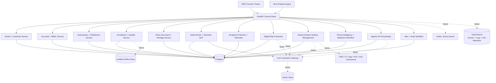
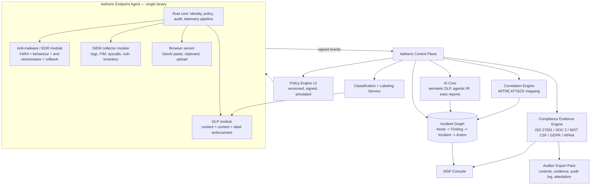

# Aetherix Architecture

Status: active POC architecture, May 2026. Companion to [docs/poc-plan.md](poc-plan.md), [docs/development.md](development.md), [docs/policy-engine.md](policy-engine.md), and [docs/multi-agent-coordination-protocol.md](multi-agent-coordination-protocol.md).
Scope: the system spine — what the pieces are, what they own, how they talk,
and where the trust boundaries sit. Not a feature catalogue.

This document is **independent**: it describes one defensible design for an
AI-native endpoint security platform. It is not a clone of any commercial
product and intentionally avoids replicating any vendor's documented internals,
APIs, UI, or terminology.

---

## 1. Design Principles

1. **Small trusted core, large untrusted edges.** The agent stays minimal and
   auditable. Anything optional (semantic classifiers, LLM reasoning, third-
   party intel) runs in the control plane, never on the endpoint.
2. **Deterministic before probabilistic.** Every AI-driven decision has a
   deterministic fallback (regex/keyword/hash). The agent never blocks based
   solely on an LLM output.
3. **Policy is data, not code.** Policies are versioned, signed documents
   evaluated by a small interpreter. The agent does not download executable
   logic.
4. **Two-way distrust between planes.** The control plane authenticates
   agents; agents verify policy signatures and reject unsigned updates.
5. **Default monitor, opt-in enforce.** New rules ship in `monitor` mode.
   Promotion to `review` or `block` requires explicit operator action with
   simulation evidence attached.
6. **Auditability over cleverness.** Every decision (detect, allow, block,
   acknowledge, policy change) writes an append-only audit record with the
   input hash, rule id, and policy version that produced it.
7. **Privacy budget.** Raw matched content never leaves the endpoint without
   a policy-declared reason. By default, only entity types, offsets, and
   hashes are shipped.

---

## 2. Planes



Each plane has its own deploy/scale story and its own threat model
(section 6). A failure in the reasoning plane must degrade to deterministic
detection, not to "fail open."

---

## 3. Component Responsibilities

### 3.1 Endpoint Agent (`agent/`)

Today: enrolls with a one-time token or installer profile, stores a per-agent secret, fetches assigned policy packages, and emits nonce-bound signed heartbeats. Forward design owns four jobs and no more:

| Job | Owns | Does NOT own |
| --- | --- | --- |
| Identity | Agent id, machine fingerprint, enrollment cert | User identity, SSO |
| Telemetry | Heartbeat, host signals, local event stream | Long-term storage |
| Local scan | Deterministic DLP rules over text the OS hands it | Semantic/LLM scoring |
| Enforcement | Apply policy actions (`monitor`/`review`/`block`, plus EDR `quarantine`/`kill`/`isolate` when explicitly promoted) | Author policy |

Hard constraints:

- No outbound calls except to the configured control-plane URL.
- No code execution from policy payloads. Policy is a typed document with
  a fixed schema; unknown fields are ignored, unknown actions are refused.
- All persisted state lives under one directory with a documented schema
  so it can be audited or wiped.
- Performance budget enforced in CI: p95 heartbeat CPU, RSS ceiling, and
  per-scan latency are tracked per release.

### 3.2 Control Plane API (`apps/api/`)

Owns the system of record. Implemented route groups:

- Agent lifecycle: `/enrollment/tokens`, `/agent/enroll`, `/agent/heartbeat`, `/agent/{agent_id}/policy`, `/agent/policy`, `/agent/policy/ack`, `/agent/dlp-evidence`.
- Customer onboarding: `/customers`, `/customers/quick-create`, `/customers/{customer_id}/installers`, `/customers/{customer_id}/quick-deploy`, `/quick-deploy/{link_id}`.
- Policy workflow: `/policy-packages`, `/policies/active`, `/policies/document`, `/policies/document/simulate`, `/policies/documents`.
- Policy Engine v2: `/policies`, `/policies/{id}`, `/policies/{id}/versions`, `/policies/{id}/simulate`, `/policies/{id}/promote`, `/policies/{id}/rollback`, `/policies/assign`, `/policies/effective`.
- Tenancy and identity: `/me`, `/auth/login`, `/auth/totp/verify`, `/auth/accept-invite`, `/roles`, `/accounts`, `/accounts/bulk-delete`, `/accounts/{id}`, `/accounts/{id}/roles`, `/accounts/{id}/password`, `/companies`, `/companies/summary`, `/companies/bulk-status`, `/companies/bulk-delete`, `/partners`.
- Licensing and AI settings: `/subscriptions`, `/companies/{id}/license`, `/companies/{id}/ai`, `/companies/{id}/ai/test`, `/ai/providers`.
- Operations and evidence: `/endpoints`, `/alerts`, `/alerts/{id}/acknowledge`, `/audit`, `/audit/verify`, `/compliance/export`, `/simulate/scenario`, `/customers/{id}/telemetry`, `/customers/{id}/security-alerts`, `/customers/{id}/incidents`, `/dlp/scan`.

Trust rules:

- Heartbeats without a valid nonce-bound HMAC signature are rejected.
- Operator-scoped routes derive access from the dev account header and persisted account/role assignments. This is enough for local POC tenancy tests, but not a production session model.
- Agent policy and DLP evidence routes validate enrolled-agent credentials.
- The `/dlp/scan` route is treated as PII-in-transit: request bodies are not logged; only hashes, findings, decisions, alerts, and evidence metadata are persisted.

### 3.2.1 Account hierarchy and tenant isolation

The console is designed around this MSP-first hierarchy:

| Level | Scope | Core permissions |
| --- | --- | --- |
| Platform Owner | Menagenix across all MSP partners and companies | Create/manage MSP partners, view global revenue and risk, manage global settings, impersonate any partner or company with audit. |
| MSP Partner | Own partner tree only | Create companies, manage licensing, create users for owned companies, configure white-label branding, generate installers. |
| Company Administrator | Assigned company | Manage company endpoints, policies, company users, reports, and response actions. |
| Company Technician | Assigned company | View and work operational queues such as incidents, quarantine, tasks, and health. |
| Company Viewer | Assigned company | Read-only reporting and audit visibility. |

Isolation rules:

- MSP Partners cannot see, query, or manage other MSP Partners' companies.
- Company users can see only their assigned company and permitted modules.
- Platform Owner impersonation is a support workflow, not a silent context switch; every impersonation start, action, and end must write audit records.
- Every new operational table must carry the required tenant context for its scope: `partner_id`, `customer_id`, and, when relevant, `group_id` and `endpoint_id`.

Current state: customers, accounts, roles, role assignments, invitations, password setup, login/TOTP challenge flow, company scoping, account hard delete, and company hard delete are persisted in Postgres and covered by API tests. The console and API now use bearer sessions (`Authorization: Bearer <jwt>`) as the only auth path. Recursive partner hierarchy semantics and full impersonation workflows remain planned hardening.

### 3.3 Data Plane

| Store | Use | Why |
| --- | --- | --- |
| Postgres | Authoritative state (endpoints, policies, current alerts, accounts, tenants, policy documents, module actions, quarantine inventory) + append-only compliance chain (`audit_log`, `evidence_events`) | ACID, joinable, hash-chained tamper evidence, easy point-in-time recovery and auditor export |
| OpenSearch | High-volume time-series security events, logs, telemetry, and investigative search (`security_alerts`, `fim_events`, `dlp_events`, `evidence_events` historical, raw SIEM/HIDS logs, historical telemetry). Powers retention policies and full-text / correlation search. | Sub-second search on massive event volumes, native Index Lifecycle Management (ILM) for hot/warm/cold/delete tiers, per-tenant data streams, built for SIEM-style log analytics and "Live Search" |
| Object store | Scan evidence, quarantine artifacts, large rollback payloads, compliance export bundles (when policy opts in) | Cheap, immutable, lifecycle policies, signed artifact references |
| Redis | Ingest queue / backpressure, rate-limit counters, short caches, session state | Fast coordination between agent fleet and control plane |
| Vector store | Embeddings for semantic DLP recall, future prompt audit / RAG over customer policy + incident corpus | Optional; only populated when semantic features are enabled |
| Graph projection (future) | companies, assets, findings, identities, infrastructure, incidents | Cross-module correlation and traversal without replacing Postgres as source of truth |

The POC uses Postgres as the single source of truth for all state and the compliance evidence chain. `apps/api/app/db.py` bootstraps schema idempotently on startup and Alembic migrations live under `apps/api/alembic/`; there is no SQLite or in-memory fallback. Tests use a separate Postgres database configured by `AETHERIX_TEST_DATABASE_URL`.

High-volume append-only event tables that drive operations, investigation, and SIEM use cases will be dual-written (or CDC-replicated) to OpenSearch so that Postgres remains the authoritative, hash-chained system of record while OpenSearch provides the scalable search + retention plane. See §3.3.1 for the detailed contract.

#### 3.3.1 Event & Log Store (OpenSearch) — Retention, Ingestion, and Index Management

OpenSearch is the dedicated store for the platform's high-volume, time-series, searchable security telemetry and logs. It directly supports the **Native SIEM / HIDS** module (architecture §3.4.2), "Live Search" investigation experience (default-policy-v1.01 and roadmap), and customer-configurable retention SLAs.

**Primary contents**
- Security detections (`security_alerts` and raw EDR events)
- FIM events (`fim_events`)
- DLP events (`dlp_events`)
- Compliance evidence events (replica of `evidence_events` carrying `chain_hash` for verification)
- Future raw SIEM/HIDS streams (Windows Event Log, journald, syslog, auditd, ETW/ESF, eBPF, app logs, netflow, etc.)
- Historical heartbeat/telemetry snapshots for timelines (distinct from the "latest state" row in Postgres `heartbeats`)

**Ingestion patterns (phased)**
- Phase 1 (current target): Dual-write inside the control plane after the Postgres transaction commits for `security_alerts`, `fim_events`, `dlp_events`, and `evidence_events`. The API remains the single source of tenant context and `evidence_controls` tagging.
- Phase 2: Postgres CDC (logical replication / Debezium) for the audit replica path and any high-volume tables where we want zero app change risk.
- Phase 3 (mature SIEM module): Agent collectors or a lightweight relay (Vector / custom) can stream raw logs directly to tenant-scoped OpenSearch ingest pipelines when volume or latency requirements exceed the heartbeat envelope. All such paths still carry tenant identifiers and are subject to the same policy + entitlement gates.

**Index & data-stream strategy**
- Tenant-isolated patterns: `aetherix-events-{partner_id}-{customer_id}-*` (or data streams with the same routing). This gives clean ILM per customer, easy snapshot/restore, and simple query scoping.
- Index templates enforce required fields on every document: `partner_id`, `customer_id`, `endpoint_id`, `module`, `detector_id`, `policy_version`, `evidence_controls[]`, `mitre_tactics[]`, `severity`, `timestamp`, plus module-specific payload.
- All security event documents carry a `postgres_chain_hash` (or `audit_seq`) reference so any result used in an auditor export or compliance report can be cross-verified against the Postgres authoritative chain.
- Separate index patterns for operational platform logs (API + agent structured logs) under `aetherix-platform-*` so customer data never mixes with control-plane observability.

**Retention & Index Lifecycle Management (ILM)**
- Retention policies are first-class customer configuration (exposed in Companies + Licensing / policy documents) and map to ILM policies:
  - Hot (last 7–30 days): full replicas, fast search, used for Live Search and active incident response.
  - Warm (30–90/365 days): searchable, fewer replicas, used for historical investigation and compliance lookbacks.
  - Cold / Frozen: searchable snapshots or frozen tier; used for long-term regulatory retention (7+ years).
  - Delete: after configured retention unless a legal-hold flag is set on the customer or specific incident.
- ILM policies are versioned and reference the customer's effective retention setting at index creation/rollover time. Changing a customer's retention updates future indices; historical indices can be migrated or left under their original policy.
- Legal hold: a customer- or incident-scoped flag that forces the Delete phase to be skipped (or moves data to a "hold" repository) until explicitly released. All hold actions write to the Postgres audit_log + evidence_events.

**Compliance & evidentiary boundary (critical)**
- Postgres (`audit_log` with its hash chain + `evidence_events`) remains the **single source of truth** for any auditor-facing export or compliance attestation. The `/compliance/export` and attestation workflows continue to read exclusively from Postgres (plus object-store artifacts).
- OpenSearch serves as a high-performance, retention-aware **query replica**. Any console feature, investigation workspace, or external SIEM export that surfaces historical events must be able to cite the corresponding Postgres `seq` / `chain_hash` or `evidence_event.id`.
- This split satisfies both "we can search 100M events in <1s" and "our compliance evidence is tamper-evident and exportable without depending on a search engine."

**Multi-tenancy & security**
- Strict document-level or index-pattern filtering at the OpenSearch layer is defense-in-depth; the primary enforcement is always in the control-plane API (tenant context on every query).
- Per-tenant credentials / API keys for any direct OpenSearch access (e.g., customer SOC teams or external SIEM connectors) are issued through the existing customer_ai_settings / integrations credential vault pattern.

**Observability tie-in**
- Platform operational logs (API, agent structured logs, future OpenTelemetry) land in a separate `aetherix-platform-*` namespace so MSP operators can debug the Aetherix control plane itself without ever seeing customer security telemetry.

This design keeps the "one evidence chain" promise of architecture §3.4.2 while giving the platform the scalable log analytics and retention capabilities that MSPs expect from a SIEM-class product. Native SIEM/HIDS collectors (roadmap) will be the largest future producers of volume into this store.

### 3.4 Reasoning Plane

LLMs and semantic classifiers live behind tenant AI settings and semantic service adapters, never inside the endpoint agent. The implemented gateway edge provides:

- Provider catalogue: disabled, Aetherix-hosted, OpenAI, Azure OpenAI, Anthropic, and Ollama.
- Per-customer encrypted API key storage with `api_key_last4` only exposed back to the console.
- License-tier gating for `ai_tier:none|hosted|byo`.
- Per-customer usage counters and quota checks before outbound AI calls.
- Optional redaction before external LLM submission.

Still planned: a dedicated prompt-audit table, vector store, OpenSearch-backed prompt/incident RAG corpus (separate from customer security telemetry), and broader structured-output evaluation harness.

The reasoning plane is **advisory**. It can raise a risk score, suggest a
playbook, draft an incident summary. It cannot, on its own, change a
policy or block traffic.

### 3.4.1 External Risk Plane: DRP, EASM, Threat Intelligence

Digital Risk Protection and External Attack Surface Management are company-
scoped, asset-centric services that feed the same incident, policy, and
reporting surfaces as endpoint and DLP. They do not bypass tenant isolation or
subscription entitlement checks.

| Service | Owns | Primary inputs | Primary outputs |
| --- | --- | --- | --- |
| DRP | Brand, executive, domain, social, repo, paste, marketplace, and dark/deep web monitoring | Managed assets, keywords, executive identities, threat feeds, OSINT collectors | Impersonation, phishing, typosquatting, credential leak, malware-hosting, and abuse findings |
| EASM | Internet-facing domains, subdomains, IPs, certificates, ports, cloud services, shadow IT | DNS, CT logs, passive DNS, cloud connectors, safe scanners, vuln feeds | Exposure findings, asset inventory deltas, CVSS/EPSS/KEV enrichment, remediation recommendations |
| Threat Intelligence | Global feeds, custom watchlists, attacker infrastructure, takedown status | Commercial/open feeds, customer reports, DRP/EASM findings | Intelligence items, correlated campaigns, takedown requests, GDN handoff status |
| Agentic IR | Investigation graph, playbooks, notifications, approvals | Endpoint telemetry, DLP decisions, DRP/EASM findings, audit, asset criticality | Root cause, timeline, confidence, recommended actions, customer-ready summary |

DRP and EASM findings are not separate dashboards that operators must reconcile
manually. They are normalized into the same risk graph:

```text
Company -> Asset -> Finding -> Incident Case -> Response Action -> Audit Record
```

This lets Aetherix answer MSP-native questions such as: "Which customers have
credential leaks tied to externally exposed VPNs?" or "Which phishing domains
imitate brands whose endpoints also saw GenAI DLP exfiltration attempts?"

### 3.4.2 Native Coverage Strategy: AV/EDR + SIEM + DLP in One Platform

Aetherix is a **single-platform, native-first** security product. The goal is
to deliver — inside one tenant-scoped control plane and one lightweight agent —
the coverage that today's MSPs assemble from three separate stacks:

- a next-generation anti-malware / EDR (behavior + ML + anti-ransomware),
- a SIEM / HIDS (log collection, FIM, vulnerability detection, MITRE mapping),
- a data classification + labeling + endpoint DLP layer (Presidio-style
  detection, sensitivity labels, label propagation, content + destination
  policy enforcement).

The AI core is not a fourth bolted-on layer; it is the connective tissue across
the three. Semantic classifiers feed DLP, behavioural baselines feed EDR,
correlation feeds SIEM detections, and an agentic investigator turns the
combined event stream into one incident narrative.

#### Why native, not aggregator

The earlier draft of this section proposed ingesting Wazuh / Bitdefender /
Microsoft signals via connectors. That path was rejected as the product
strategy for three reasons:

1. **One platform, one evidence chain.** ISO 27001:2022, SOC 2, NIST CSF 2.0,
   GDPR, and HIPAA audits all reward a single auditable system of record.
   Stitching three vendors' alerts, exports, and timestamps together produces
   weaker evidence than one tenant-scoped, hash-chained audit log that links
   policy → detection → response → ticket → resolution.
2. **MSP economics.** Reselling three upstream licenses on top of Aetherix
   crushes margin. A single native platform with one license model is what
   MSPs actually want to sell.
3. **AI leverage.** When the platform owns the agent, the detector, and the
   classifier, AI can be used end-to-end (training signal, telemetry shape,
   policy authoring). With connectors, AI only re-ranks other vendors'
   verdicts.

Connectors may still ship later as **migration aids** (read-only import from
Wazuh / GravityZone / Defender during onboarding), but they are not the
product. A GravityZone / Wazuh capability gap review for future deployment
planning lives in [docs/native-security-gap-review.md](native-security-gap-review.md).



#### Capability coverage matrix (target)

The table below is the **product specification** — what each native module
must own to claim parity with the categories Aetherix is replacing. Each row
also names the deterministic baseline that ships first and the AI layer that
adds value on top.

| Module | Deterministic baseline (must ship) | AI layer (differentiator) | Compliance controls this evidences |
| --- | --- | --- | --- |
| **Next-gen anti-malware / EDR** | Signature + YARA scanning, hash reputation, PE/script inspection, behaviour rules, anti-ransomware (canary files + entropy delta + rollback via VSS / FS snapshots), process tree, network attack signatures, IOC matching, quarantine + kill + isolate | Behavioural baselining per endpoint, ML scoring for unknown PE/scripts, agentic post-detection investigation, exploit-chain summarization | ISO 27001 A.8.7, A.8.16; SOC 2 CC6.6, CC7.1; NIST CSF DE.CM, RS.AN |
| **SIEM / HIDS** | Log collection (syslog, Windows Event Log, journald, app logs), parser library, FIM (file integrity monitoring), rootkit checks, software inventory + CVE matching with EPSS/KEV, CIS benchmark scans, syscall/eBPF event stream, correlation rule engine, MITRE ATT&CK mapping | Natural-language detection authoring, anomaly detection on user/host baselines, alert noise reduction, plain-English incident timelines | ISO 27001 A.8.15, A.8.16, A.8.32, A.5.25; SOC 2 CC7.2, CC7.3; NIST CSF DE.AE, RS.AN |
| **DLP — classification + labeling + policy** | Presidio-compatible PII detection, regex/keyword/EDM rules, content fingerprinting, sensitivity labels (Public/Internal/Confidential/Restricted, customer-extensible), label propagation across copy/move/rename, endpoint policy enforcement (clipboard, file, upload, email, USB, print, screenshot guard), browser sensor for GenAI destinations | Semantic classifier for context-aware sensitivity, intent-aware destination policy, auto-labeling suggestions with confidence, redacted-summary generation for review queues | ISO 27001 A.5.12, A.5.13, A.8.10, A.8.11, A.8.12; SOC 2 CC6.1, CC6.7; GDPR Art. 5, Art. 32; HIPAA §164.312(a)(1) |
| **Compliance Evidence Engine** | Control catalogue (ISO 27001:2022 Annex A, SOC 2 TSC 2017, NIST CSF 2.0, GDPR Art. 32, HIPAA Security Rule), evidence-mapping rules from native events to controls, append-only hash-chained audit log, scheduled control reviews, attestation workflow, auditor export pack (PDF + signed JSON + raw evidence references) | AI-drafted control narratives ("how this customer satisfies A.8.10"), gap analysis against target framework, what-if remediation roadmap | Self-evidencing — this module is the deliverable to the auditor |

Compliance is not a separate product. Every native event the platform records
(detection, scan, policy decision, label change, configuration change,
account action, response action) is tagged with the controls it evidences at
write time, so the export pack is generated from real artefacts — not
back-filled paperwork.

#### Single-agent design

One signed binary per OS, with modules gated by subscription entitlements at
the control plane (the agent always ships the code; the policy package
declares which modules are active for a given customer).

| Module | Linux | Windows | macOS |
| --- | --- | --- | --- |
| Anti-malware / EDR | eBPF + LSM hooks, fanotify | ETW providers, mini-filter (signed driver, later phase), Defender complement mode | Endpoint Security framework (`EndpointSecurity.framework`), Network Extension |
| SIEM collector | journald, syslog, auditd, file tailers, eBPF syscall stream | Windows Event Log subscriptions, ETW, WMI, registry watch | unified logs (`os_log`), `ESF` audit events, file tailers |
| DLP enforcement | fanotify + LSM for file ops, clipboard via X11/Wayland helpers, browser extension for GenAI | mini-filter (later phase) or user-mode hooks for clipboard/file, Office add-in, browser extension | Endpoint Security file events, pasteboard observers, browser extension |
| Vuln + inventory | dpkg/rpm/apk + language registries (pip/npm/cargo/maven), kernel/CPE matching | MSI/Appx/winget inventory, KB/patch state | pkgutil + Homebrew + system_profiler |

Phase ordering (user-mode first, kernel modules only after a signed-release
pipeline + dedicated systems team exist): see §8.

Current EDR response implementation is user-mode and policy-gated. YARA,
ransomware, IOC, and process-chain detections default to `monitor`/`review`
unless the resolved `RuntimePolicy` explicitly promotes them. Quarantine writes
an AES-256-GCM encrypted artifact plus a reversible manifest containing original
path, metadata, file hash, KDF parameters, per-artifact salt, previous manifest
hash, and manifest hash. New quarantine keys are derived with Argon2id from the
agent secret; legacy manifests without KDF metadata remain restorable through the
old raw/SHA-256 compatibility path. Process kill uses platform process APIs
where available (`kill(2)` on Unix with `sysinfo` fallback,
`sysinfo`/TerminateProcess-backed behavior on Windows). Network isolation
currently records auditable intent only; host firewall rule backends remain a
planned platform increment.

The agent also exposes narrow quarantine management primitives through the
existing `/agent/actions` queue: list and restore. Remote `quarantine`, `kill`,
and `isolate` actions are normalized into the same `ResponseEvidence` shape as
local policy-driven actions, emitted back via heartbeat as `response_action` EDR
events, and dangerous actions are denied unless the active policy already
promotes the matching detector kind. This keeps operator-queued actions inside
the same self-protection and evidence pipeline as autonomous endpoint response.
`quarantine_list` evidence returns operator-safe item summaries with `can_restore`, `severity_hint`, and `approval_hint` fields. `quarantine_restore` treats the quarantine id as the target and returns failed evidence for malformed or missing ids. The control plane now provides the complete operator surface for remote quarantine management (severity-gated restore requests, approve/deny endpoints with distinct-operator enforcement, global pending inbox, per-endpoint cached inventory, and response-action history). All operator steps and agent execution emit differentiated compliance evidence. High/Critical restores require dual-operator approval by default; Medium/Low use single-operator approval plus the tenant `quarantine_restore_approval` policy toggle. Rate-limiting and abuse detection are expected on the operator paths.

Ransomware rollback remains a planned interface, not an executable response in
the current agent. The first implementation should keep the same default-safe
shape as quarantine restore: a detector emits affected paths and a rollback
candidate set, the agent records local snapshot-provider capability, and the
control plane queues an approved rollback intent only after simulation evidence.
The endpoint-side boundary should be a narrow `RollbackProvider` interface; see
[edr-ransomware-rollback-interface.md](edr-ransomware-rollback-interface.md) for
the planning-only sketch. Provider backends are OS-specific: Windows VSS where
available, filesystem or volume snapshots on Linux, and APFS snapshots on macOS.
Until those providers exist and are destructively tested, ransomware response
stays limited to quarantine, process termination, isolation intent, and evidence.

Richer process-tree behavior and anti-exploit telemetry are also in planning
only. The next safe increment should deepen deterministic lineage, script-abuse,
and exploit-precursor evidence before any prevention claim; see
[edr-behavior-anti-exploit-interface.md](edr-behavior-anti-exploit-interface.md)
for the interface sketch. New behavior and anti-exploit rules should ship in
`monitor` by default, emit explicit insufficient-telemetry/refusal states, and
avoid expanding destructive response actions until policy simulation and OS
provider testing exist.

#### Deterministic-before-probabilistic, restated for this design

Every module ships its deterministic baseline first. AI capabilities (semantic
classifier, behaviour ML, agentic IR, narrative authoring) are additive and
always have a deterministic fallback that satisfies the underlying compliance
control on its own. An auditor never sees "the AI said so" as the only
control evidence.

#### What we are *not* building

- Not a kernel-mode AV with proprietary signatures in v1. Anti-malware ships
  with YARA + behaviour + IOCs + community-feed signatures; proprietary
  engine work waits until there is a signed-driver pipeline.
- Not a full SOAR. The agentic IR layer recommends and gates response
  actions; complex multi-system orchestration stays manual until v2.
- Not a replacement for Microsoft 365 in-tenant DLP for Exchange/SharePoint
  mail flow — Aetherix DLP enforces on the **endpoint** (and managed browser)
  and labels the data, which travels with the file.

### 3.5 Presentation Plane (`apps/console/`)

Pure client of the API. No business logic, no direct DB access, no
direct LLM calls. The console's job is to make policy state, alert state,
and endpoint state legible — and to make destructive actions explicit
(confirmation + reason field + audit entry).

Implemented console foundation:

- Full MSP navigation structure: Monitoring, Incidents, Protection, MSP Control, Add-ons, and Configuration.
- Companies + Licensing page: paged `/companies/summary`, customer creation through `/customers/quick-create`, hard delete and soft lifecycle bulk actions, license editing, AI provider settings/testing, policy assignment, installer generation, Core + add-ons packaging view, AI Efficiency Score, and white-label entry point.
- Accounts page: API-backed account list, filters, bulk hard delete, add/edit modal, invitation link/email delivery modes, role-based company assignment, module permissions, 2FA enforcement state, password policy, and permission matrix.
- Policy Engine v2 page: API-backed create/list/detail, effective policy preview, simulation, destructive promotion approval, assignment, and entitlement-aware locked sections.
- Antimalware & Behavior and Quarantine pages: three-panel triage workspaces with live remote EDR data (per-endpoint quarantine inventory snapshots from the agent, full response-action history, severity-based restore staging with interactive dual-operator approval for high/critical items, global Approvals Inbox, and `StagedActionBadge` driven by real server `ModuleActionResult` status including "executed" and "denied"). The reusable protection module pattern (DetectionTable + DetailPanel + ActionStagingPanel + shared `StagedActionBadge` + `permissions.ts`) is now used consistently across Quarantine, Antimalware, Web Protection, Device Control, Blocklist, Custom Rules, and Risk pages.

Planned console hardening:

- Replace dev header sign-in with production sessions.
- Drive every visible action from server-confirmed permissions and feature entitlements.
- Add recursive company filter semantics backed by tenant-aware API queries.
- Add white-label theme tokens per MSP Partner.
- Add visual regression checks for the wide MSP navigation and modal workflows.

---

## 4. Core Data Contracts

These are the contracts the rest of the system is built on. They should
move slowly and be versioned when they do.

### 4.1 Heartbeat (agent → API)

Already defined in [apps/api/app/schemas.py](apps/api/app/schemas.py) as
`AgentHeartbeat`. Forward additions:

- `nonce` (per-heartbeat, server-tracked, replay protection).
- `previous_signature` (hash chain for tamper detection of the local log).
- `enrolled_cert_fingerprint` (binds the heartbeat to enrollment identity).

### 4.2 Policy (API → agent, API → console)

Today's `Policy` is a flat summary. The forward shape is a document:

```jsonc
{
  "id": "policy-2026-05-16-001",
  "version": 7,
  "signed_by": "control-plane-key-id",
  "signature": "...",
  "mode_default": "monitor",
  "rules": [
    { "id": "pii.email", "kind": "regex", "pattern": "...", "action": "review" },
    { "id": "secret.aws_key", "kind": "regex", "pattern": "...", "action": "block" },
    { "id": "semantic.financial_intent", "kind": "semantic", "threshold": 0.82, "action": "review" }
  ],
  "escalate_at": "high",
  "genai_destinations": { "monitor": true, "block_on": ["block"] }
}
```

Rule kinds the agent understands are fixed in code. Unknown kinds are
ignored with a warning — never executed.

Policy Engine v2 is defined in [docs/policy-engine.md](policy-engine.md). It adds subscription-aware module sections, inheritance, entitlement validation, white-label branding, semantic DLP, agentic response, AI reports, and SMB templates.

### 4.3 Alert (API → console, API → integrations)

Already in `schemas.Alert`. Forward additions: `evidence_ref` (object-store
URL, only populated when policy opted in), `decision_trace` (ordered list
of rule ids that fired), `policy_version` (which version produced it).

### 4.4 Audit record (everything → audit store)

```jsonc
{
  "ts": "...",
  "actor": "user:alice" | "agent:<id>" | "system",
  "action": "policy.promote" | "alert.ack" | "dlp.scan" | ...,
  "resource": "policy:policy-2026-05-16-001",
  "before_hash": "...",
  "after_hash": "...",
  "request_id": "..."
}
```

Append-only. No update path. Backed by a table with a hash chain so
deletions are detectable.

### 4.5 Tenant and installer contracts

The tenant hierarchy is `Partner -> Customer -> Group -> Endpoint`. Enrollment tokens, installer builds, Quick Deploy links, enrolled agents, heartbeats, and alerts carry tenant context so MSP views can be scoped safely.

Installer profiles are JSON documents generated by the control plane and embedded into platform-specific packages:

```jsonc
{
   "control_plane_url": "https://api.example.com",
   "deployment_mode": "cloud",
   "partner_id": "...",
   "customer_id": "...",
   "customer_number": "CUST-1001",
   "group_id": null,
   "policy_package_id": "...",
   "platform": "windows_msi",
   "enrollment_token": "single-use-token",
   "expires_at": "...",
   "profile_signature": "..."
}
```

The POC returns installer metadata and profiles. Real MSI/EXE/PKG/DEB/RPM assembly and code signing are next-step packaging work.

### 4.6 External risk contracts

Every DRP, EASM, and threat-intelligence record carries `partner_id`,
`customer_id`, `source`, `confidence`, `severity`, `first_seen_at`,
`last_seen_at`, and `status`. Raw collection evidence is optional and governed
by customer privacy settings; normalized metadata stays queryable for MSP rollup
views and incident correlation.

Recommended core tables:

```sql
monitored_assets
- id uuid primary key
- partner_id uuid not null references partners(id)
- customer_id uuid not null references customers(id)
- asset_type text not null -- brand | domain | executive | social_account | repo | ip | certificate | cloud_service
- display_name text not null
- identifiers jsonb not null default '{}'::jsonb
- business_criticality text not null default 'medium'
- tags jsonb not null default '[]'::jsonb
- status text not null default 'active'
- created_at timestamptz not null

drp_findings
- id uuid primary key
- partner_id uuid not null references partners(id)
- customer_id uuid not null references customers(id)
- asset_id uuid references monitored_assets(id)
- finding_type text not null -- impersonation | phishing | typosquat | credential_leak | brand_abuse | malware_hosting | repo_secret
- source text not null
- evidence_ref text
- observed_value text not null
- severity text not null
- confidence integer not null
- ai_explanation text
- status text not null default 'new'
- first_seen_at timestamptz not null
- last_seen_at timestamptz not null

easm_assets
- id uuid primary key
- partner_id uuid not null references partners(id)
- customer_id uuid not null references customers(id)
- parent_asset_id uuid references monitored_assets(id)
- asset_type text not null -- domain | subdomain | ip | port | certificate | service | cloud_resource
- value text not null
- discovered_by text not null
- metadata jsonb not null default '{}'::jsonb
- first_seen_at timestamptz not null
- last_seen_at timestamptz not null
- status text not null default 'active'

easm_findings
- id uuid primary key
- partner_id uuid not null references partners(id)
- customer_id uuid not null references customers(id)
- easm_asset_id uuid not null references easm_assets(id)
- finding_type text not null -- exposed_service | weak_tls | expired_cert | vulnerable_software | shadow_it | risky_dns_change
- cvss numeric(3,1)
- epss numeric(6,5)
- kev boolean not null default false
- remediation text not null
- ai_remediation_summary text
- severity text not null
- status text not null default 'new'
- first_seen_at timestamptz not null
- last_seen_at timestamptz not null

intelligence_items
- id uuid primary key
- partner_id uuid references partners(id)
- customer_id uuid references customers(id)
- item_type text not null -- indicator | campaign | actor | leak | malware | infrastructure
- value text not null
- source text not null
- confidence integer not null
- related_finding_ids jsonb not null default '[]'::jsonb
- expires_at timestamptz
- created_at timestamptz not null

takedown_requests
- id uuid primary key
- partner_id uuid not null references partners(id)
- customer_id uuid not null references customers(id)
- finding_id uuid not null
- request_type text not null -- domain | social | content | repository | marketplace
- provider text not null
- status text not null -- draft | submitted | accepted | rejected | completed | escalated
- submitted_at timestamptz
- completed_at timestamptz
- audit_payload jsonb not null default '{}'::jsonb
```

These tables should be paired with append-only `asset_change_events` so EASM can
explain deltas: newly exposed port, removed certificate, DNS change, or shadow
service discovered outside the expected inventory.

---

## 5. Request Flows

### 5.1 Heartbeat

1. Agent collects signals, builds `AgentHeartbeat`, signs with shared
   secret for legacy dev mode or the enrolled per-agent secret.
2. `POST /agent/heartbeat`.
3. API verifies signature, checks nonce, upserts endpoint, emits audit.
4. The agent fetches its assigned package with `/agent/{agent_id}/policy` and persists it locally.

### 5.2 Customer Quick Deploy

1. MSP submits `POST /customers/quick-create` with customer profile, selected package, and target platforms.
2. API creates customer, default group, policy assignment, installer build records, signed install profiles, and Quick Deploy links.
3. MSP shares the generated link or direct installer metadata with the SMB customer.
4. Quick Deploy resolution mints a short-lived single-use enrollment token.
5. Installed agent exchanges the token, receives its secret, downloads assigned policy, and starts signed heartbeats.

### 5.3 DLP scan (operator-initiated, current PoC path)

1. Console `POST /dlp/scan` with text.
2. API runs deterministic scan (`services/dlp.scan_text`).
3. API applies active policy (`apply_policy`).
4. API persists an alert with hashes only; raw text is not stored.
5. Response returns findings + action + risk.

### 5.4 Policy promotion

1. Operator edits draft policy in console.
2. Console calls `/policies/document/simulate`. API evaluates samples against the active document and the draft, then returns a decision diff.
3. Operator approves; console calls `/policies/document`.
4. API signs the new version, writes audit, bumps `policy.version`.
5. Agents pick up the new version on next heartbeat.

---

## 6. Threat Model (Summary)

A full STRIDE pass belongs in its own document. The headline assumptions:

| Adversary | Goal | Primary mitigation |
| --- | --- | --- |
| Endpoint user with local admin | Disable agent, forge heartbeats | Signed enrollment, server-side nonce, tamper-evident local log |
| Network attacker | Inject/replay heartbeats, sniff scans | mTLS, signed payloads, no raw scan text in transit metadata |
| Malicious tenant operator | Exfil other tenants' data | Tenant id on every row, enforced in query layer, audit on every read |
| Compromised LLM provider | Poison outputs to mask detections | LLM is advisory only; deterministic rules are independent path |
| Supply-chain compromise of agent | Mass endpoint compromise | Reproducible builds, signed releases, SBOM, staged rollout w/ rollback |
| Insider at control plane | Silent policy weakening | Hash-chained audit, dual-control for `block`→`monitor` downgrades |

### 6.1 Explicit non-goals

- Aetherix is not a kernel-mode AV today. Anything requiring kernel
  drivers, hooking, or process injection is out of scope until there is
  a dedicated systems team and a signed-driver release pipeline.
- Aetherix does not ship offensive tooling, exploit code, or automated
  remediation that runs without an operator approval gate.

---

## 7. Mapping to Current Repository

| Architectural element | Lives in | State |
| --- | --- | --- |
| Endpoint agent (identity, heartbeat) | [agent/src/main.rs](../agent/src/main.rs) | Token enrollment client + nonce-bound HMAC heartbeats implemented |
| Control plane API | [apps/api/app/main.py](../apps/api/app/main.py) | Core routes present |
| Data contracts | [apps/api/app/schemas.py](../apps/api/app/schemas.py) | Tenant, customer, policy, installer, enrollment, heartbeat, and alert contracts defined |
| Deterministic DLP | [apps/api/app/services/dlp.py](../apps/api/app/services/dlp.py) | Implemented |
| Semantic DLP (reasoning plane edge) | [apps/api/app/services/semantic.py](../apps/api/app/services/semantic.py) | Implemented deterministic context scoring with optional external LLM enrichment hooks; enforcement remains deterministic-first |
| Classification + labeling service | — | Planned: sensitivity-label model + label-propagation rules + endpoint enforcement |
| Anti-malware / EDR module | [agent/src/edr](../agent/src/edr), [apps/api/app/services/state.py](../apps/api/app/services/state.py) | Implemented first slice: YARA-X scanning/cache, IOC matching, process tree rules, ransomware canary/entropy/mass-write detection, Argon2id-backed reversible quarantine with list/restore primitives, process kill, isolation-intent evidence, remote action evidence, and heartbeat-to-alert mapping. Rollback, firewall enforcement, and richer OS telemetry remain planned. |
| SIEM / HIDS collectors | — | Planned: log + FIM + syscall/eBPF + vuln-inventory collectors in `agent/`, parser + correlation + MITRE mapping in `apps/api`; all high-volume streams land in OpenSearch (tenant-isolated data streams + ILM) for search + retention while Postgres holds the compliance chain |
| Compliance Evidence Engine | [apps/api/app/services/compliance.py](../apps/api/app/services/compliance.py), [apps/api/app/db.py](../apps/api/app/db.py) | v0 implemented: seeded control catalogue, `evidence_controls` tags on audit / alert / policy-document writes, and signed JSON export via `/compliance/export` |
| DRP / EASM contracts | — | Planned: add `monitored_assets`, `drp_findings`, `easm_assets`, `easm_findings`, `intelligence_items`, `takedown_requests` |
| State store | [apps/api/app/db.py](../apps/api/app/db.py), [apps/api/app/services/state.py](../apps/api/app/services/state.py) | Postgres-backed POC state |
| Console | [apps/console/src/App.tsx](../apps/console/src/App.tsx), [apps/console/src/pages/CompaniesPage.tsx](../apps/console/src/pages/CompaniesPage.tsx), [apps/console/src/pages/AccountsPage.tsx](../apps/console/src/pages/AccountsPage.tsx) | Full MSP navigation, operations, alerts, DLP scanner, policy editor/simulation, Companies + Licensing, Accounts hierarchy, Quick Deploy |
| Audit log | [apps/api/app/services/audit.py](../apps/api/app/services/audit.py) | Implemented (hash-chained) in Postgres as authoritative source of truth. OpenSearch receives a query-optimized replica (with chain_hash) for fast search and investigation; never used for compliance exports or chain verification |
| AI settings / semantic gateway edge | [apps/api/app/services/ai_settings.py](../apps/api/app/services/ai_settings.py), [apps/api/app/services/semantic.py](../apps/api/app/services/semantic.py) | Provider catalogue, encrypted BYO keys, tier gates, quota counters, redaction, semantic DLP integration implemented; prompt audit/vector store remain future hardening |
| Enrollment / mTLS | [apps/api/app/services/enrollment.py](../apps/api/app/services/enrollment.py), [apps/api/app/services/customers.py](../apps/api/app/services/customers.py) | Token enrollment, tenant-bound installer profiles, per-agent HMAC implemented; Ed25519/mTLS remains future hardening |

---

**Living References for current state** (post-May 2026 remote EDR management milestone):
- [multi-agent-coordination-protocol.md](multi-agent-coordination-protocol.md) — the operating model.
- [current-capabilities-snapshot-2026-05-29.md](current-capabilities-snapshot-2026-05-29.md) — concise snapshot of delivered capabilities.
- Recent `coordination-brief-cycle-*.md` + `console-wiring-remote-edr.md` — detailed cycle artifacts and the authoritative wiring contract (kept as living records).

## 8. Next Architectural Increments

Ordered by risk-reduction, not by feature appeal.

1. **Audit log module.** Done: append-only table + write helper called from
   every mutating route. Unblocks everything else.
2. **Postgres-backed state.** Done for the PoC using schema bootstrap in `db.py`.
3. **Policy document v1.** Done: moved `Policy` from flat summary to the
   document shape in §4.2. Add `policy.version` to heartbeat round-trip.
4. **Agent enrollment.** Done for the PoC: one-time token exchange,
   per-agent HMAC secret, nonce + replay protection, and Rust client support.
5. **Simulation endpoint.** Done: `/policies/document/simulate` evaluates
   draft policy changes without mutating active state.
6. **AI settings / semantic gateway edge.** Implemented: provider catalogue,
   encrypted customer keys, license-tier gates, quota counters, redaction, and
   semantic DLP integration. Next: prompt audit, vector store, richer structured
   output validation, and broader provider health telemetry.
7. **Tenant model.** Implemented for customer enrollment, installers, enrolled agents, heartbeats, alerts, accounts, roles, licensing, and policy assignments. Next: enforce recursive tenant scoping on every query and fully retire the API dev-auth fallback path.
8. **MSP console foundation.** Done in the console/API: Companies + Licensing, Accounts hierarchy, subscriptions/licenses, AI settings, full navigation, role matrix, and implementation roadmap panels. Next: white-label persistence, impersonation start/end/action UX, and server-confirmed action visibility.
9. **Simulation event store.** Implemented first slice: `telemetry_events`, `security_alerts`, `incident_cases`, and `/simulate/scenario`. Next: more scenarios, console timeline workspace, and DRP/EASM-linked incidents.
10. **External risk foundation.** Next: monitored assets, DRP findings, EASM asset discovery, finding normalization, and tenant-scoped rollups.
11. **Agentic correlation.** First slice implemented: FIM ↔ EDR cross-module correlation engine joins `fim_events` and EDR-derived `security_alerts` on a normalised `file_path` within a configurable time window (`AETHERIX_CORRELATION_WINDOW_SECONDS`, default 600s). Matches automatically uplift the security alert severity (medium→high, high→critical), record `correlation_links` edges, decorate the alert payload, and emit a `correlation.severity_uplift` evidence event mapped to ISO 27001 A.5.25/A.8.16, SOC 2 CC7.2/CC7.3, NIST CSF DE.AE + RS.AN. The `GET /security-alerts/{id}/correlations` endpoint exposes the linked signals for the console alert detail view. Next: extend to DLP↔EDR (sha256), DRP/EASM exposure ↔ endpoint incident graph, and human-approved response actions.
12. **Native AV / EDR module v0.** First slice implemented: YARA-X + IOC scanner, process tree monitoring, ransomware canary/entropy/mass-write heuristics, policy-gated reversible quarantine with Argon2id KDF metadata and list/restore primitives, process kill, isolation-intent evidence, remote action evidence, and control-plane action-state visibility. Next: rollback, platform firewall enforcement, richer OS telemetry, and broader signature/reputation feeds.
13. **Native SIEM / HIDS module v0.** Next: log + FIM collectors in the agent, parser library + correlation rule engine in the control plane, MITRE ATT&CK tag on every detection, software-inventory + CVE matching with EPSS/KEV.
14. **Classification + labeling service.** Next: sensitivity-label model (Public / Internal / Confidential / Restricted, customer-extensible), label propagation rules on copy/move/rename, endpoint enforcement of label-aware destination policy.
15. **Compliance Evidence Engine v0.** Done for the first slice: control catalogue tables, event→control tagging at write time on audit / alert / policy-document paths, and signed JSON auditor export via `/compliance/export?customer_id=...&framework=iso27001-2022`. Next: scheduled control reviews, attestation workflow, PDF export, and broader per-framework catalogue coverage.
16. **GravityZone / Wazuh parity planning.** Next: maintain [docs/native-security-gap-review.md](native-security-gap-review.md) as the deployment checklist for what Aetherix already covers natively, what remains future work, and what should stay out of v1 claims.

Each step is independently shippable and leaves the system in a working
state. None of them requires copying a third-party product to validate.
