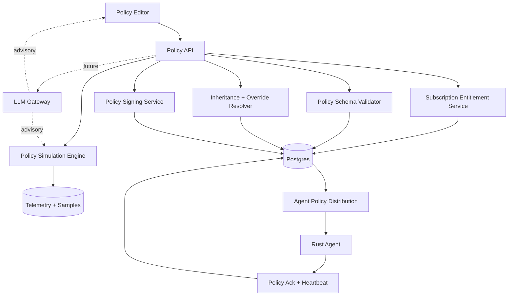

# Aetherix Policy Engine

Status: implemented POC architecture plus target roadmap for Policy Engine v2, May 2026.

This document defines the subscription-aware, AI-enhanced policy engine Aetherix is building on top of the legacy signed policy document and policy package POC. The current repository implements the v2 foundation; later sections still describe the broader target module set.

The concrete Default Policy v1.01 planning baseline lives in [default-policy-v1.01.md](default-policy-v1.01.md). It maps the GravityZone-style endpoint policy modules into Aetherix-native policy sections and adds Aetherix-specific controls such as GenAI DLP, Compliance Evidence Engine tagging, signed simulation, DRP/EASM, and AI-assisted investigation.

The current implementation has:

- Legacy v1 signed DLP policy document routes under `/policies/document*` and `/policies/active`.
- Policy packages assigned to customers during Quick Deploy.
- Policy Engine v2 CRUD/list/detail/update/delete under `/policies`.
- Versioned policy records, simulation records, promotion gates, rollback, assignments, effective policy resolution, agent fetch, policy ack, and DLP evidence emission.
- Subscription and company-license records used for entitlement checks.
- Tenant-aware enrollment and installer profiles.

Policy Engine v2 extends that into a modular policy system with subscription enforcement, inheritance, semantic DLP, GenAI Guardrails, and evidence-by-construction. Rich endpoint controls, agentic response, AI reports, and white-label customization remain target modules unless a later section explicitly calls out implemented behavior.

## 1. Design Goals

1. **Subscription-aware by default.** A policy can only enable modules licensed for the customer subscription.
2. **Policy is structured data.** Policies are versioned JSON documents validated by schema, signed by the control plane, and interpreted by agents and services.
3. **MSP-first inheritance.** Resolution order is MSP default, customer policy, group override, endpoint override.
4. **AI-assisted, deterministic enforcement.** AI can recommend, explain, summarize, and classify, but enforcement must have a deterministic rule path and audit trail.
5. **Calm operator experience.** Hide unavailable modules, explain why sections are locked, show active features clearly, and simulate impact before rollout.
6. **Cloud and on-prem ready.** The same document model works in SaaS, MSP-hosted, customer-hosted, and air-gapped deployments.

## 2. High-Level Architecture



Core responsibilities:

- **Policy API**: create, update, validate, simulate, assign, promote, rollback.
- **Entitlement Service**: determines which modules a customer can use.
- **Validator**: enforces JSON schema and subscription constraints.
- **Resolver**: materializes the effective policy for a customer, group, or endpoint.
- **Simulator**: evaluates draft changes against samples and recent telemetry.
- **Signer**: signs promoted policy versions and policy packages.
- **Distribution**: delivers policy to agents and tracks acknowledgements.

## 3. Subscription Model

Subscriptions should be explicit records, not implicit flags in policy JSON.

```sql
subscriptions
- id uuid primary key
- partner_id uuid not null references partners(id)
- customer_id uuid not null references customers(id)
- plan text not null -- starter | professional | enterprise | mdr | custom
- status text not null -- active | trial | suspended | expired
- valid_from timestamptz not null
- valid_until timestamptz
- created_at timestamptz not null

subscription_entitlements
- id uuid primary key
- subscription_id uuid not null references subscriptions(id)
- module_key text not null
- tier text not null -- core | addon | preview
- enabled boolean not null
- limits jsonb not null default '{}'
- created_at timestamptz not null
```

Core module keys, included in every subscription:

```text
general
antimalware
firewall
network_protection
device_control
behavior_monitoring
anti_exploit
ransomware_mitigation
web_protection
basic_risk_analytics
integrity_monitoring
relay
```

Add-on module keys:

```text
advanced_threat_security
xdr_edr_agentic_response
patch_management
sandbox_analyzer
email_protection
full_disk_encryption
virtualized_container_mobile_security
advanced_semantic_dlp
ai_report_generation
digital_risk_protection
external_attack_surface_management
threat_intelligence_takedown
xdr_correlation_graph
```

Backend enforcement rules:

- Disabled modules may be present only as `mode: "unlicensed"` or omitted.
- Assignment fails if the effective policy enables a module not licensed for the target customer.
- Simulation may include unlicensed modules only when `preview: true`; promotion cannot.
- Entitlement checks run at create, update, assignment, promotion, and policy resolution time.
- Seat-based limits apply to endpoint and user modules; asset-based limits apply to DRP and EASM assets such as domains, executives, brands, IP ranges, and monitored social accounts.

## 4. Policy Data Model

The target document is a typed JSON envelope with modular sections.

```jsonc
{
  "schema_version": "2.0",
  "id": "policy-uuid",
  "name": "Healthcare Baseline",
  "description": "Balanced protection for clinics and small healthcare offices",
  "scope": {
    "partner_id": "...",
    "customer_id": "...",
    "group_id": null,
    "endpoint_id": null
  },
  "lineage": {
    "parent_policy_id": "msp-default-policy-id",
    "inheritance_mode": "inherit_with_overrides"
  },
  "version": 12,
  "status": "draft",
  "mode_default": "monitor",
  "created_by": "user:msp-admin",
  "created_at": "...",
  "updated_at": "...",
  "signed_by": "control-plane-key-id",
  "signature": "...",
  "modules": {}
}
```

Policy status values:

```text
draft | simulated | promoted | active | superseded | archived
```

Policy action values:

```text
allow | monitor | notify | review | isolate | rollback | block
```

### 4.1 General

```jsonc
{
  "general": {
    "enabled": true,
    "display_name": "General Protection",
    "description": "Baseline agent behavior and update settings",
    "agent_update_channel": "stable",
    "update_window": {
      "timezone": "customer-local",
      "start": "02:00",
      "end": "05:00"
    },
    "tamper_protection": true,
    "agent_health_reporting": true,
    "privacy_level": "metadata_only",
    "cloud_lookup": true,
    "on_prem_relay_required": false
  }
}
```

### 4.2 Antimalware

```jsonc
{
  "antimalware": {
    "enabled": true,
    "on_access": {
      "enabled": true,
      "mode": "monitor",
      "scan_archives": false,
      "scan_network_shares": true,
      "max_file_size_mb": 256
    },
    "on_execute": {
      "enabled": true,
      "block_unknown_high_risk": true,
      "cloud_reputation": true
    },
    "on_demand": {
      "enabled": true,
      "schedule": "weekly",
      "day": "sunday",
      "time": "03:00"
    },
    "exclusions": []
  }
}
```

### 4.3 Firewall And Network Protection

```jsonc
{
  "firewall": {
    "enabled": true,
    "default_inbound": "block",
    "default_outbound": "allow",
    "profiles": ["office", "remote", "untrusted_wifi"],
    "rules": [
      {
        "id": "allow-rmm-agent",
        "direction": "outbound",
        "protocol": "tcp",
        "remote": "rmm.example.com:443",
        "action": "allow"
      }
    ]
  },
  "network_protection": {
    "enabled": true,
    "dns_reputation": true,
    "lateral_movement_detection": true,
    "command_and_control_detection": true,
    "rare_destination_threshold": "medium",
    "action": "review"
  }
}
```

### 4.4 Device Control

```jsonc
{
  "device_control": {
    "enabled": true,
    "usb_storage": {
      "default_action": "review",
      "allow_encrypted_devices": true,
      "block_unknown_write": true
    },
    "printer_control": {
      "enabled": true,
      "sensitive_document_action": "review"
    },
    "bluetooth": {
      "enabled": true,
      "file_transfer_action": "block"
    },
    "approved_devices": []
  }
}
```

### 4.5 Behavior Monitoring, Anti-Exploit, Ransomware

```jsonc
{
  "behavior_monitoring": {
    "enabled": true,
    "process_tree_analysis": true,
    "lolbin_detection": true,
    "persistence_detection": true,
    "credential_access_detection": true,
    "high_confidence_action": "isolate",
    "medium_confidence_action": "review"
  },
  "anti_exploit": {
    "enabled": true,
    "memory_protection": true,
    "script_abuse_detection": true,
    "office_child_process_block": true,
    "browser_exploit_mitigation": true
  },
  "ransomware_mitigation": {
    "enabled": true,
    "mass_file_change_detection": true,
    "shadow_copy_protection": true,
    "secure_rollback": true,
    "auto_isolate_on_high_confidence": true,
    "rollback_approval": "operator_required"
  }
}
```

### 4.6 Web Protection

```jsonc
{
  "web_protection": {
    "enabled": true,
    "anti_phishing": true,
    "url_reputation": true,
    "browser_guardrails": true,
    "blocked_categories": ["malware", "credential_theft", "newly_registered_domains"],
    "genai_destinations": [
      "copilot.microsoft.com",
      "claude.ai",
      "gemini.google.com",
      "chat.openai.com"
    ],
    "sensitive_paste_action": "review"
  }
}
```

### 4.7 Semantic DLP

Advanced semantic DLP is an add-on module. Basic deterministic DLP can remain available in core plans.

```jsonc
{
  "semantic_dlp": {
    "enabled": true,
    "entitlement": "advanced_semantic_dlp",
    "mode": "review",
    "detectors": {
      "presidio_entities": ["EMAIL_ADDRESS", "PHONE_NUMBER", "CREDIT_CARD", "US_SSN"],
      "regex_rules": [],
      "keyword_rules": [],
      "exact_data_match": []
    },
    "semantic_classifiers": [
      {
        "id": "customer_sensitive",
        "label": "Customer-sensitive business record",
        "threshold": 0.82,
        "action": "review"
      },
      {
        "id": "source_code_secret_context",
        "label": "Source code or secrets with operational context",
        "threshold": 0.78,
        "action": "block"
      }
    ],
    "genai_guardrails": {
      "enabled": true,
      "destinations": ["copilot", "claude", "gemini", "chatgpt"],
      "paste_action": "review",
      "upload_action": "block",
      "allow_user_justification": true,
      "redaction_preview": true
    },
    "privacy": {
      "store_raw_content": false,
      "hash_matched_content": true,
      "llm_provider": "gateway",
      "local_only_mode": false
    }
  }
}
```

### 4.8 Agentic AI Response

```jsonc
{
  "agentic_response": {
    "enabled": true,
    "entitlement": "xdr_edr_agentic_response",
    "investigation_mode": "human_approved",
    "playbooks": [
      {
        "id": "ransomware-triage",
        "trigger": "ransomware.high_confidence",
        "steps": ["isolate_endpoint", "collect_process_tree", "summarize_timeline", "request_rollback_approval"],
        "auto_execute": ["collect_process_tree", "summarize_timeline"],
        "requires_approval": ["isolate_endpoint", "rollback_files"]
      }
    ],
    "smart_notifications": {
      "channels": ["email", "teams", "webhook"],
      "quiet_hours": true,
      "notify_customer_contact": "critical_only",
      "notify_msp_soc": "medium_and_above"
    },
    "remediation": {
      "one_click_actions": ["isolate", "kill_process", "block_domain", "revert_policy"],
      "fully_autonomous_actions": ["collect_evidence", "draft_summary"],
      "approval_required_for_destructive_actions": true
    }
  }
}
```

### 4.9 AI Report Generation

```jsonc
{
  "ai_reports": {
    "enabled": true,
    "entitlement": "ai_report_generation",
    "schedule": "monthly",
    "audiences": ["executive", "technical"],
    "include": {
      "endpoint_posture": true,
      "top_vulnerabilities": true,
      "genai_dlp_incidents": true,
      "human_risk": true,
      "business_risk_score": true,
      "remediation_playbooks": true
    },
    "language_style": "plain_business_language",
    "white_label_branding": true,
    "approval_before_customer_send": true
  }
}
```

### 4.10 Digital Risk Protection

Digital Risk Protection is an add-on module scoped to monitored company assets.
It should default to monitor/review workflows until evidence quality is proven for
each collector and source type.

```jsonc
{
  "digital_risk_protection": {
    "enabled": true,
    "entitlement": "digital_risk_protection",
    "asset_limits": {
      "brands": 3,
      "executives": 10,
      "domains": 25,
      "social_accounts": 50
    },
    "monitored_sources": [
      "domain_registries",
      "phishing_feeds",
      "paste_sites",
      "source_code_repos",
      "social_networks",
      "marketplaces",
      "telegram_discord_irc",
      "dark_web"
    ],
    "detections": {
      "impersonation": { "enabled": true, "action": "review" },
      "phishing": { "enabled": true, "action": "review" },
      "typosquatting": { "enabled": true, "action": "review" },
      "credential_leaks": { "enabled": true, "action": "review" },
      "brand_or_executive_abuse": { "enabled": true, "action": "review" },
      "malware_hosting": { "enabled": true, "action": "review" },
      "repo_secrets": { "enabled": true, "action": "review" }
    },
    "ai_validation": {
      "enabled": true,
      "nlp_language_and_sentiment": true,
      "computer_vision_logo_ocr_face_match": false,
      "llm_explanations": true,
      "minimum_confidence_for_auto_incident": 80
    }
  }
}
```

### 4.11 External Attack Surface Management And Takedown

EASM is an add-on module with asset-based licensing and strict safe-scanning
defaults. Takedown is a separate entitlement because it creates external provider
workflows and legal/operational obligations.

```jsonc
{
  "external_attack_surface_management": {
    "enabled": true,
    "entitlement": "external_attack_surface_management",
    "asset_limits": {
      "root_domains": 10,
      "subdomains": 1000,
      "ip_addresses": 256,
      "cloud_accounts": 3
    },
    "discovery": {
      "dns": true,
      "certificate_transparency": true,
      "passive_dns": true,
      "cloud_connectors": true,
      "safe_port_scan": true,
      "shadow_it_detection": true
    },
    "enrichment": {
      "cvss": true,
      "epss": true,
      "cisa_kev": true,
      "exploit_availability": true,
      "business_criticality": true,
      "ai_remediation_summary": true
    },
    "change_detection": {
      "new_asset_action": "review",
      "new_open_port_action": "review",
      "expired_certificate_action": "review",
      "critical_vulnerability_action": "review"
    }
  },
  "threat_intelligence_takedown": {
    "enabled": true,
    "entitlement": "threat_intelligence_takedown",
    "supported_workflows": ["domain", "social", "content", "repository", "marketplace"],
    "automation": {
      "draft_request": true,
      "submit_requires_approval": true,
      "track_provider_status": true,
      "gdn_handoff": true
    }
  }
}
```

### 4.12 White-Label Branding

```jsonc
{
  "white_label": {
    "enabled": true,
    "policy_display_name": "Client Protection Standard",
    "section_labels": {
      "semantic_dlp": "AI Data Protection",
      "agentic_response": "Smart Response"
    },
    "descriptions": {
      "semantic_dlp": "Protects sensitive client information from accidental AI tool exposure."
    },
    "report_branding_profile_id": "msp-brand-default",
    "hide_aetherix_branding": true
  }
}
```

## 5. Inheritance And Effective Policy Resolution

Resolution order:

```text
MSP Default -> Customer Policy -> Group Override -> Endpoint Override
```

Merge rules:

- Scalar values override parent values.
- Object values deep-merge by key.
- Lists use an explicit strategy: `replace`, `append`, or `subtract`.
- Locked parent settings cannot be changed by child policies.
- Unlicensed child settings are rejected even if inherited from a richer MSP default.

Example override metadata:

```jsonc
{
  "overrides": {
    "semantic_dlp.genai_guardrails.upload_action": {
      "value": "block",
      "locked": false,
      "reason": "Finance group handles payroll exports"
    }
  }
}
```

## 6. Backend API Design

Policy library:

```http
GET  /policy-templates
GET  /policy-templates/{template_id}
POST /policy-packages
GET  /policy-packages
GET  /policy-packages/{policy_id}
POST /policy-packages/{policy_id}/versions
POST /policy-packages/{policy_id}/promote
POST /policy-packages/{policy_id}/rollback
```

Validation and simulation:

```http
POST /policy-packages/validate
POST /policy-packages/simulate
POST /policy-packages/effective-preview
```

Assignment:

```http
POST /customers/{customer_id}/policy-assignment
GET  /customers/{customer_id}/policy-assignment
POST /customer-groups/{group_id}/policy-assignment
POST /endpoints/{endpoint_id}/policy-assignment
GET  /agent/{agent_id}/policy
POST /agent/policy/ack
```

Subscriptions:

```http
GET  /customers/{customer_id}/subscription
GET  /customers/{customer_id}/entitlements
POST /customers/{customer_id}/entitlements/validate-policy
```

AI assistance:

```http
POST /policy-assistant/suggest-template
POST /policy-assistant/explain-change
POST /policy-assistant/suggest-dlp-rule
POST /policy-assistant/summarize-impact
```

AI assistant routes must stay advisory and must not promote policies directly.

## 7. Frontend Policy Editor Structure

The editor should be organized as a left navigation with subscription-aware sections:

1. Overview and assignment scope.
2. Subscription coverage and locked modules.
3. General.
4. Antimalware.
5. Firewall and network protection.
6. Web protection.
7. Device control.
8. Behavior monitoring, anti-exploit, ransomware.
9. Semantic DLP and GenAI guardrails.
10. Agentic response.
11. DRP monitored assets and detections.
12. EASM discovery and exposure management.
13. Threat intelligence and takedown workflows.
14. AI reports.
15. White-label labels and descriptions.
16. Exclusions.
17. Simulation and impact preview.
18. Audit and version history.

Dynamic section states:

- **Active**: licensed and enabled.
- **Available**: licensed but disabled.
- **Locked**: not licensed; visible with upgrade reason and no editable controls.
- **Preview**: allowed in simulation only.
- **Inherited**: value comes from parent policy.
- **Overridden**: value differs from parent policy.

Editor requirements:

- Always show why a module is locked.
- Surface inherited values inline.
- Require simulation before promotion to `review`, `block`, `isolate`, or `rollback` actions.
- Show projected endpoints affected by a change.
- Show policy package and subscription compatibility before assignment.
- Provide AI suggestions as drafts the operator must accept explicitly.

## 8. Recommended Default Templates

The first template to implement should be [Default Policy v1.01](default-policy-v1.01.md). It is the MSP-wide baseline that mirrors the expected core endpoint stack while preserving Aetherix's deterministic-first and evidence-by-construction rules.

### 8.1 SMB Baseline Protection

- Target: general small business.
- Mode: monitor/review, low noise.
- Enabled: core modules, basic DLP, web protection, behavior monitoring.
- Add-ons: none required.
- Default actions: review risky DLP, block known phishing, isolate only high-confidence ransomware.

### 8.2 Healthcare Privacy Guard

- Target: clinics, dental offices, small providers.
- Mode: review/block for PHI-like data.
- Enabled: semantic DLP, GenAI upload block, USB review, AI executive reports.
- Emphasis: patient data, insurance identifiers, appointment exports, audit evidence.

### 8.3 Finance And Accounting Shield

- Target: accounting firms, bookkeepers, small financial offices.
- Mode: stronger DLP and device controls.
- Enabled: semantic DLP, full disk encryption add-on, patch management, AI reports.
- Emphasis: payroll, tax records, banking data, file exfiltration, unknown USB writes.

### 8.4 Legal Confidentiality Standard

- Target: law firms and legal services.
- Mode: review by default, block high-confidence privileged/client matter data to GenAI.
- Enabled: semantic DLP, web guardrails, email protection, white-label reports.
- Emphasis: client names, matter IDs, contracts, privileged communication.

### 8.5 Manufacturing Resilience Profile

- Target: manufacturing and operations-heavy SMBs.
- Mode: availability-aware, low false-positive tolerance.
- Enabled: behavior monitoring, ransomware mitigation, network protection, patch management.
- Emphasis: ransomware, lateral movement, legacy systems, OT-adjacent exclusions.

## 9. Enrollment Integration

Customer onboarding should remain one-click:

1. MSP creates customer.
2. Console suggests template based on industry, company size, and subscription.
3. MSP accepts or edits the template.
4. Backend validates subscription compatibility.
5. Backend assigns the policy package to customer or group.
6. Installer generation embeds the policy package id in the install profile.
7. Agent enrolls and fetches the effective assigned policy.
8. Agent acknowledges policy version after applying controls.

Installer profile linkage:

```jsonc
{
  "customer_id": "...",
  "group_id": "...",
  "policy_package_id": "...",
  "policy_version": 12,
  "enrollment_token": "single-use-token"
}
```

## 10. Implementation Roadmap

1. Add subscription and entitlement tables.
2. Define `PolicyDocumentV2` schemas with module sections and validators.
3. Encode [Default Policy v1.01](default-policy-v1.01.md) as the first policy template fixture.
4. Add entitlement validation for create, update, assign, promote, and effective policy fetch.
5. Add inheritance resolver and effective policy preview endpoint.
6. Extend policy packages to store v2 payloads while preserving current v1 DLP policy document support.
7. Update policy editor to section-based navigation with locked module states.
8. Add default templates for the five SMB profiles above.
9. Add simulation support for module-level impact, not just DLP samples.
10. Add agent policy acknowledgement endpoint and rollout status in the console.
11. Add AI assistant routes only after the LLM gateway, budget controls, and prompt audit exist.

## 11. Acceptance Criteria

- Policy creation fails if a draft enables an unlicensed module.
- Assignment fails if the target customer lacks required entitlements.
- Effective policy resolution is deterministic and covered by tests for MSP, customer, group, and endpoint layers.
- Promotion signs a canonical JSON document and writes an audit record.
- The console clearly distinguishes active, available, locked, inherited, and overridden sections.
- Customer Quick Deploy can assign a template, generate installers, enroll an endpoint, and fetch the effective policy package.
- AI-generated suggestions are never promoted without explicit operator action.
