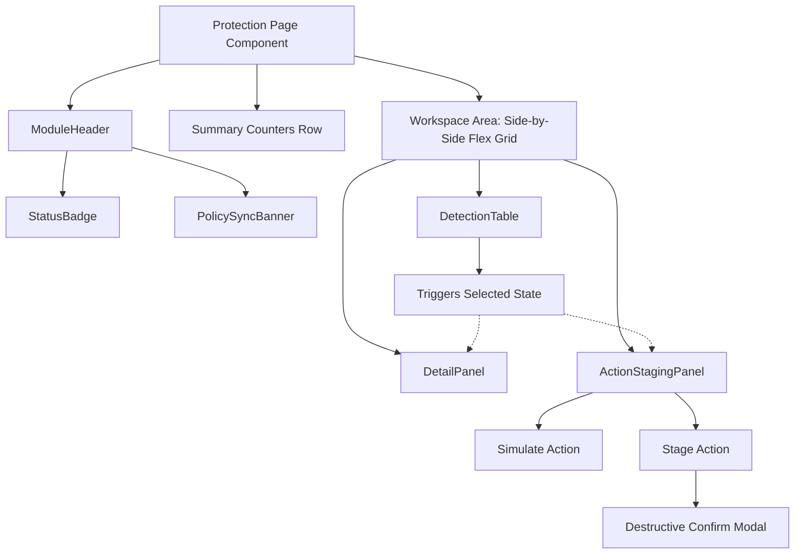

# Protection Module Page Template Guide

This document establishes the architecture, component pattern, and standard workflows for designing consistent security compliance and threat mitigation modules under the **Risk** and **Protection** workspaces of the Aetherix Console.

Use this template for console workflow foundations. A page built from it is not a delivered detector until it is wired to real backend routes, tenant-scoped data, policy resolution, and evidence/audit writes.

---

## Folder and File Structure

The reusable elements are structured in the following directories:

```text
apps/console/src/
├── components/
│   └── protection/
│       ├── types.ts                 # Standard domain TypeScript interfaces
│       ├── StatusBadge.tsx          # Protected / Review Needed / Disabled status pills
│       ├── PolicySyncBanner.tsx     # Dynamic policy sync metadata strip
│       ├── EmptyState.tsx           # Standard Empty & Loading components
│       ├── ModuleHeader.tsx         # Unified title + actions + active sync banner
│       ├── DetectionTable.tsx       # Core searchable, sortable list of active alarms
│       ├── DetailPanel.tsx          # Central context panel displaying deep telemetry
│       └── ActionStagingPanel.tsx   # Workflow for Dry Runs, Staging & Confirmation
└── pages/
    ├── ProtectionModuleTemplate.tsx # Scaffolded implementation template
    └── AntimalwareBehavior.tsx      # Standardized implementation page for Antimalware
```

---

## Core Types and Interfaces

The standard data elements are defined in `apps/console/src/components/protection/types.ts`. All protection pages should map their backend API responses to these schemas:

```typescript
export type ModuleStatus = "protected" | "review_needed" | "disabled" | "planned";
export type RiskRank = "low" | "medium" | "high" | "critical";
export type DetectionStatus = "new" | "investigating" | "staged" | "resolved";
export type ActionStatus = "queued" | "awaiting_approval" | "approved" | "failed";

export interface Detection {
  id: string;
  customer_id?: string | null;
  endpoint_id: string | null;
  endpoint_name: string;
  title: string;
  source: string;
  description: string;
  risk_score: number;
  risk_band: RiskRank;
  confidence: number;
  recommended_action: string;
  status: DetectionStatus;
  created_at: string;
  context?: Record<string, any>;
}

export interface StagedAction {
  id: string;
  detection_id: string;
  action: string;
  status: ActionStatus;
  approval_required: boolean;
  requested_by: string;
  created_at: string;
  note?: string | null;
}
```

---

## Interactive 3-Panel Layout Tree



---

## Building a New Module

Follow this recipe to build any new protection module (for example, `DeviceControl.tsx` or `WebProtectionPage.tsx`):

### Step 1: Copy the Template
Duplicate the scaffolding file `apps/console/src/pages/ProtectionModuleTemplate.tsx` into your target page file, say `apps/console/src/pages/WebProtectionPage.tsx`.

### Step 2: Establish the Module Action List
Define the list of response actions applicable to the specific security domain:
```typescript
const WEB_PROTECTION_ACTIONS = [
  { value: "block_domain", label: "Block URL Domain Globally", destructive: true },
  { value: "proxy_traffic", label: "Reroute through Secure Gatekeeper Proxy", destructive: false },
  { value: "isolate_endpoint", label: "Isolate Endpoint Network Controller", destructive: true },
  { value: "dismiss_override", label: "Permit Exception Manually", destructive: false },
];
```

### Step 3: Map Back-end Endpoints
Hook up standard REST/Query hooks to fetch data:
1. `GET /policies/effective?module=web_control` to hydrate your policy status.
2. `GET /web-control/alerts` (with fallback mapping from `/alerts` standard endpoints) to supply active warnings.
3. `POST /web-control/simulate` to verify risk and dependency outcomes.
4. `POST /web-control/stage-action` to stage containment events.

### Step 4: Add Custom Context Visualizers
If your module has specialized context (like firewall flows, domain block statistics, or browser agent trees), pass a `customContextRenderer` to the `DetailPanel` component:
```typescript
<DetailPanel 
  detection={selectedDetection} 
  customContextRenderer={(d) => (
    <div className="webPayloadView">
      <h4>Requested Host: <code>{d.context?.requested_domain}</code></h4>
      <span>IP Path: {d.context?.remote_ip}</span>
    </div>
  )}
/>
```

---

## Best Practices and Guidelines

- **Simulate Before Staging**: Force simulations for any action listed with `destructive: true`. Disable the "Stage" button until a successful simulation has been generated.
- **Calm, Green/Cream UI Palette**: Keep container designs consistent with shadows, borders using `var(--line)`, and backgrounds using `var(--panel)` or `rgba(11, 107, 87, 0.02)`.
- **Response Staging Confirms**: Always pop up a clean Confirmation Modal before executing an action marked destructive.
